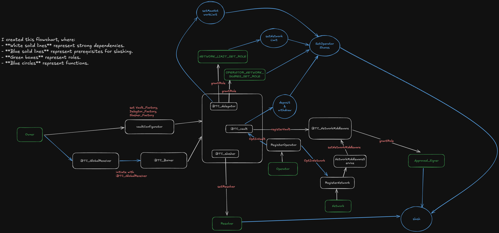
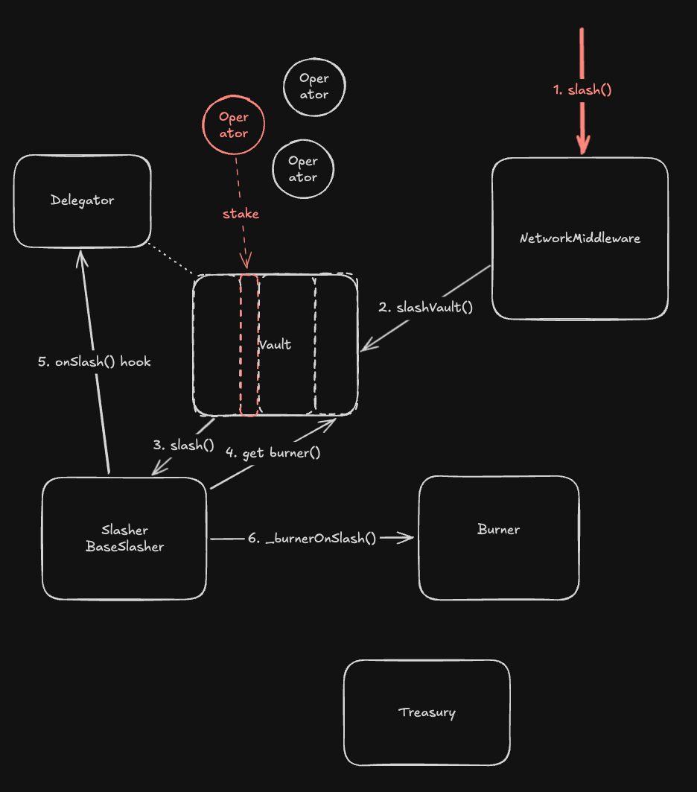

[](https://github.com/DLC-link/dlc-symbiotic/actions/workflows/test.yml)

# dlc-symbiotic

Repository for iBTC Network's Symbiotic integration.

## Development

### Build

```shell
$ forge build
```

### Test

```shell
$ forge test
```

## Usage

You can start a local Sepolia fork using:

```shell
anvil --fork-url https://eth-sepolia.g.alchemy.com/v2/your-api-key
```

And deploy a standard configuration of a Vault and the NetworkMiddleware contract using:

```shell
forge script DeployAll 11155111 --rpc-url http://localhost:8545 --broadcast -vvvv --private-key 0x59c6995e998f97a5a0044966f0945389dc9e86dae88c7a8412f4603b6b78690d --sig 'run(uint256)'
```

## Workflow and Dependencies



### Slashing


